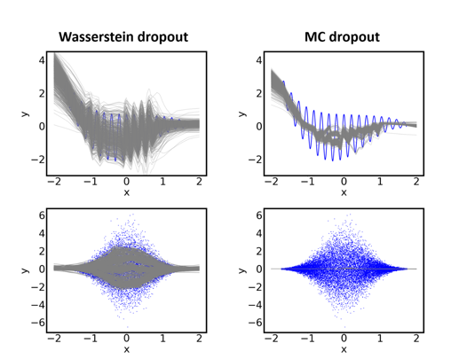

# Wasserstein Dropout

This code repository accompanies our publication ["Wasserstein dropout"](https://arxiv.org/abs/2012.12687). 

## Overview

The repository is structured as follows: Code for training, evaluation and benchmarking of our [Wasserstein](https://en.wikipedia.org/wiki/Wasserstein_metric) dropout technique on standard 1D regression datasets can be found in the subdirectory `01_wdropout_on_standard_1d_regression_datasets`.
For a teaser plot illustrating the benefits of Wasserstein dropout on 1D toy data, see below.

The second subdirectory `02_wdropout_for_object_detection` contains code for training and evaluating a W-dropout-enhanced version of the object detection (OD) architecture [SqueezeDet](https://arxiv.org/abs/1612.01051). This W-SqueezeDet model is moreover compared to an [MC-dropout](https://arxiv.org/abs/1506.02142)-enhanced version of the same OD network.



*Comparison of [Wasserstein dropout](https://arxiv.org/abs/2012.12687) (left-hand side) and [MC dropout](https://arxiv.org/abs/1506.02142) (right-hand side) on two 1D toy datasets.*

## License

The Wasserstein dropout code is released under the MIT license.

## Citing Wasserstein Dropout

If you use or reference Wasserstein dropout in your research, please use the following BibTeX entry:

```BibTeX
@article{wdropout,
url = {https://arxiv.org/abs/2012.12687},
author = {Sicking, Joachim and Akila, Maram and Pintz, Maximilian and Wirtz, Tim and Wrobel, Stefan and Fischer, Asja},
title = {Wasserstein Dropout},
publisher = {arXiv},
year = {2021}
}
```
